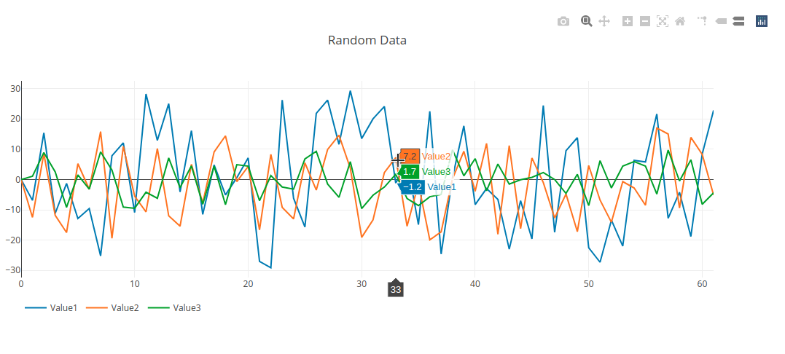

# Plotly complex sample
Sample flask webapp with a little more complex plotly use.

Data is randomly generated every 2sec.



## Getting Started

### Installing

From project root create virtual environment, activate it and install requirements:

```sh
~/flask_plotly_complex_sample$ python3 -m venv venv
~/flask_plotly_complex_sample$ source venv/bin/activate
~/flask_plotly_complex_sample$ pip install -r requirements.txt
```

## Running

__as app__

```sh
export FLASK_APP=flaskr
flask run
```

__as wsgi server__

```sh
gunicorn --worker-class eventlet -w 1 -b localhost:8080 wsgi
```

## Deployment

As seen above, as any wsgi app.

## Authors 

Franco Parodi <franco.parodi@aol.com>

## License

This project is licensed under the MIT License.
